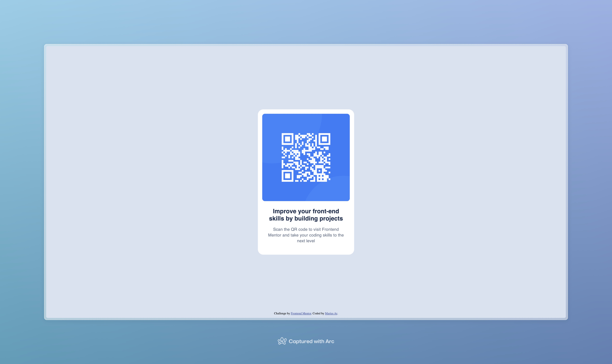

# Frontend Mentor - QR code component solution

This is a solution to the [QR code component challenge on Frontend Mentor](https://www.frontendmentor.io/challenges/qr-code-component-iux_sIO_H). Frontend Mentor challenges help you improve your coding skills by building realistic projects. 

## Table of contents

- [Overview](#overview)
  - [Screenshot](#screenshot)
  - [Links](#links)
- [My process](#my-process)
  - [Built with](#built-with)
  - [What I learned](#what-i-learned)
  - [Continued development](#continued-development)
- [Author](#author)

## Overview

### Screenshot

### Links

- [Live Site](https://marius-ar.github.io)

## My process

### Built with

- Semantic HTML5 markup
- CSS custom properties & nesting
- Flex
- Docker

### What I learned

Deploying my solution using GitHub Pages

The Frontend Mentor workflow

### Continued development

I need to keep on practicing how to integrate UI from a design, which is more akin to a "real-life" workflow

I need to learn more about creating accessible web pages

I'd like to delve into GitHub Actions to deploy more complex websites on platforms other than GitHub Pages

## Author

- Frontend Mentor - [@marius.ar](https://www.frontendmentor.io/profile/marius.ar)
